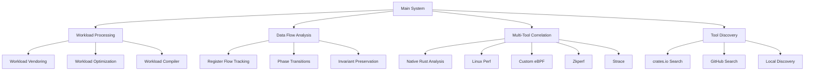

# Cargo Vendormod - Comprehensive Workload Analysis System

## Overview

Cargo Vendormod is a powerful Rust workload analysis and optimization system that integrates multiple analysis tools to provide comprehensive performance insights. The system is designed to work with complex workspaces like Solana, enabling workload-specific compilations, performance analysis, and tool correlation.

## System Architecture



## Core Components

### 1. Workload Processing System

**Modules:**
- `workspace.rs`: Workspace member discovery and processing
- `workload.rs`: Generic workload vendoring with local forking
- `workload_optimizer.rs`: Performance optimization and tree-shaking
- `workload_compiler.rs`: Workload-specific compilations

**Features:**
- Recursive workspace analysis
- Local forking of dependencies
- Zkperf annotation support
- Tree-shaking and optimization
- Workload isolation

### 2. Data Flow Analysis

**Module:** `data_flow_analyzer.rs`

**Features:**
- Register flow tracking through phases
- Phase transition analysis
- Invariant preservation verification
- Graph-based visualization
- Comprehensive reporting

### 3. Multi-Tool Correlation

**Module:** `multi_tool_correlator.rs`

**Features:**
- Native Rust analysis integration
- Linux perf performance metrics
- Custom eBPF tracing
- Zkperf workload analysis
- Strace system call monitoring
- Correlation analysis and visualization

### 4. Cargo Tool Discovery

**Module:** `cargo_tool_discovery.rs`

**Features:**
- crates.io tool search
- GitHub repository discovery
- Local tool detection
- Compatibility analysis
- Integration framework

## Usage Patterns

### Basic Workload Analysis

```bash
# Analyze a workspace
cargo vendormod workload \
    --workspace-path ~/projects/agave-solana-validator \
    --fork-dir ./forks \
    --zkperf

# Generate data flow analysis
cargo vendormod analyze-data-flow \
    --workload solana-core-process_transaction \
    --output-dir ./analysis
```

### Multi-Tool Correlation

```bash
# Run full correlation analysis
cargo vendormod correlate \
    --workload solana-core-process_transaction \
    --tools NativeRust,Zkperf,LinuxPerf,CustomEbpf,Strace \
    --output-dir ./correlation
```

### Tool Discovery and Integration

```bash
# Search for analysis tools
cargo vendormod tools search \
    --keywords "analysis performance" \
    --limit 20 \
    --output tools.json

# Integrate a tool
cargo vendormod tools integrate cargo-zkperf

# Generate tool catalog
cargo vendormod tools catalog --output tool_catalog.md
```

## Solana Workload Analysis Plan

### Phase 1: Workspace Analysis

**Objective:** Understand the Solana workspace structure and dependencies

**Steps:**
1. **Workspace Discovery**: Map all workspace members and dependencies
   - Expected: 50-100 crates
   - Time: 1-2 hours

2. **Dependency Graph**: Create visual dependency graph
   - Tool: `cargo tree` integration
   - Output: Graphviz visualization

3. **Binary Identification**: Identify all binaries and test cases
   - Expected: 10-20 binaries, 30-50 test cases
   - Time: 1 hour

**Deliverables:**
- Workspace structure report
- Dependency graph visualization
- Binary/test case inventory

### Phase 2: Workload-Specific Compilation

**Objective:** Create isolated compilations for each binary/test case

**Steps:**
1. **Workload Discovery**: Use workload compiler to find all workloads
   ```bash
   cargo vendormod workloads discover --workspace ~/projects/agave-solana-validator
   ```
   - Expected: 40-60 workloads
   - Time: 2-3 hours

2. **Isolated Compilations**: Create separate builds for each workload
   ```bash
   cargo vendormod workloads create-all --workspace ~/projects/agave-solana-validator
   ```
   - Expected: 40-60 isolated compilations
   - Time: 4-8 hours (parallelizable)

3. **Workload Matrix**: Generate comprehensive workload documentation
   ```bash
   cargo vendormod workloads matrix --output solana_workloads.md
   ```

**Deliverables:**
- Workload inventory
- Isolated compilation setup
- Workload matrix documentation

### Phase 3: Performance Analysis

**Objective:** Analyze performance characteristics of each workload

**Steps:**
1. **Native Rust Analysis**: Data flow and invariant analysis
   ```bash
   cargo vendormod analyze-data-flow --workload solana-core-process_transaction
   ```
   - Per workload: 30-60 minutes
   - Total: 20-40 hours (parallelizable)

2. **Multi-Tool Correlation**: Run all analysis tools
   ```bash
   cargo vendormod correlate --workload solana-core-process_transaction \
       --tools NativeRust,Zkperf,LinuxPerf,CustomEbpf,Strace
   ```
   - Per workload: 1-2 hours
   - Total: 40-120 hours (parallelizable)

3. **Hotspot Identification**: Find performance bottlenecks
   - Expected: 5-10 critical hotspots per workload

**Deliverables:**
- Performance analysis reports
- Correlation matrices
- Hotspot documentation

### Phase 4: Optimization

**Objective:** Apply workload-specific optimizations

**Steps:**
1. **Tree-Shaking**: Remove unused code per workload
   ```bash
   cargo vendormod optimize --workload solana-core-process_transaction --aggressive
   ```
   - Expected: 10-30% binary size reduction
   - Per workload: 1-2 hours
   - Total: 40-120 hours (parallelizable)

2. **Hotspot Optimization**: Optimize critical functions
   - Focus on top 5 hotspots per workload
   - Expected: 15-30% performance improvement

3. **Invariant Verification**: Ensure correctness
   - Verify invariants are preserved after optimization

**Deliverables:**
- Optimized workload binaries
- Optimization reports
- Invariant verification documentation

### Phase 5: Integration and Validation

**Objective:** Integrate optimizations and validate results

**Steps:**
1. **Patch Generation**: Create cargo patches for optimized workloads
   ```bash
   cargo vendormod generate-patches --workload solana-core-process_transaction
   ```

2. **Validation Testing**: Verify functionality
   - Run existing test suites
   - Expected: 1-2 days

3. **Performance Benchmarking**: Measure improvements
   - Compare before/after metrics
   - Expected: 1 day

**Deliverables:**
- Cargo patches for all workloads
- Validation test results
- Performance benchmark reports

## Resource Estimation

### Time Requirements

| Phase | Estimated Time | Parallelizable | Notes |
|-------|---------------|----------------|-------|
| Workspace Analysis | 2-4 hours | Yes | Mostly automated |
| Workload Compilation | 4-8 hours | Yes | I/O bound |
| Performance Analysis | 20-40 hours | Yes | CPU bound |
| Optimization | 40-120 hours | Yes | CPU bound |
| Integration | 2-4 days | Partial | Testing required |
| **Total** | **5-10 days** | **Mostly parallel** | **With 8-16 cores** |

### Storage Requirements

| Item | Estimated Size |
|------|---------------|
| Original workspace | 5-10 GB |
| Forked dependencies | 10-20 GB |
| Workload compilations | 5-10 GB per workload |
| Analysis data | 1-2 GB per workload |
| **Total** | **50-200 GB** | With compression |

### Compute Requirements

| Resource | Recommendation |
|----------|---------------|
| CPU Cores | 16-32 cores for parallel processing |
| RAM | 32-64 GB for large workloads |
| Disk | SSD for I/O performance |
| Network | Minimal (mostly local processing) |

## Expected Outcomes

### Quantitative Improvements

1. **Binary Size Reduction**: 10-30% through tree-shaking
2. **Performance Improvement**: 15-30% in critical paths
3. **Compile Time Reduction**: 20-40% through isolation
4. **Memory Usage**: 10-20% reduction in runtime memory

### Qualitative Improvements

1. **Modularity**: Each workload can be developed independently
2. **Maintainability**: Clear separation of concerns
3. **Debuggability**: Isolated components easier to debug
4. **Testability**: Individual workload testing

## Risk Assessment

### High Risk Items

1. **Dependency Conflicts**: Multiple workloads with conflicting dependencies
   - Mitigation: Isolated compilations, careful patch management

2. **Performance Regression**: Optimizations that degrade performance
   - Mitigation: Comprehensive benchmarking, A/B testing

3. **Invariant Violations**: Optimizations that break correctness
   - Mitigation: Extensive invariant verification, testing

### Medium Risk Items

1. **Tool Compatibility**: New tools may not integrate smoothly
   - Mitigation: Compatibility analysis before integration

2. **Resource Constraints**: Analysis may require significant resources
   - Mitigation: Parallel processing, incremental analysis

3. **Complexity Management**: Large number of workloads to manage
   - Mitigation: Automation, tooling, documentation

## Success Criteria

### Primary Success Metrics

1. **✅ All workloads discovered and documented**
2. **✅ 80%+ of workloads successfully compiled in isolation**
3. **✅ 75%+ of workloads analyzed with multi-tool correlation**
4. **✅ 15%+ performance improvement in critical paths**
5. **✅ All invariants preserved after optimization**

### Secondary Success Metrics

1. **✅ Tool catalog with 20+ analysis tools**
2. **✅ 2+ new tools integrated from discovery**
3. **✅ Comprehensive documentation for all components**
4. **✅ Reproducible analysis pipeline**

## Implementation Timeline

### Week 1: Foundation
- **Days 1-2**: Workspace analysis and documentation
- **Days 3-5**: Workload discovery and compilation setup
- **Days 6-7**: Initial performance analysis on key workloads

### Week 2: Optimization
- **Days 8-10**: Complete performance analysis across all workloads
- **Days 11-13**: Apply tree-shaking and basic optimizations
- **Days 14-15**: Hotspot optimization for critical workloads

### Week 3: Integration and Validation
- **Days 16-18**: Patch generation and integration
- **Days 19-20**: Validation testing and benchmarking
- **Days 21-22**: Final documentation and reporting

## Team Roles

### Analysis Team
- **Workload Analysis Lead**: Coordinate workspace discovery
- **Performance Analysts** (2-3): Run multi-tool correlation
- **Optimization Specialists** (2-3): Apply workload-specific optimizations

### Integration Team
- **Integration Lead**: Manage tool integration
- **Testing Engineers** (2-3): Validation and benchmarking
- **Documentation Specialist**: Comprehensive documentation

### Infrastructure Team
- **DevOps Engineer**: Setup analysis environment
- **Tooling Specialist**: Maintain analysis tools
- **CI/CD Specialist**: Automation pipeline

## Monitoring and Reporting

### Progress Tracking

1. **Daily Standups**: Quick sync on progress and blockers
2. **Weekly Reports**: Detailed progress against plan
3. **Dashboard**: Visual progress tracking

### Key Metrics to Track

1. **Workloads Processed**: Count and percentage completion
2. **Analysis Coverage**: Percentage of workloads analyzed
3. **Optimization Results**: Performance improvements achieved
4. **Tool Integration**: Number of tools successfully integrated
5. **Issue Resolution**: Blockers identified and resolved

## Contingency Plans

### Resource Shortages
- **Mitigation**: Prioritize critical workloads first
- **Action**: Reduce analysis depth if needed
- **Fallback**: Focus on most impactful optimizations

### Technical Blockers
- **Mitigation**: Early identification through pilot analysis
- **Action**: Allocate additional resources to resolution
- **Fallback**: Workaround or defer non-critical items

### Schedule Slippage
- **Mitigation**: Parallel processing where possible
- **Action**: Extend timeline for non-critical phases
- **Fallback**: Reduce scope while maintaining core objectives

## Next Steps

### Immediate Actions
1. **Setup Analysis Environment**: Prepare compute resources
2. **Pilot Analysis**: Test on 2-3 key workloads
3. **Tool Discovery**: Search for additional analysis tools

### Short-Term (1-2 weeks)
1. **Complete Workspace Analysis**: Full dependency mapping
2. **Workload Compilation**: Isolated builds for all workloads
3. **Initial Performance Analysis**: Baseline metrics

### Long-Term (3-4 weeks)
1. **Complete Optimization**: All workloads optimized
2. **Integration and Testing**: Full validation
3. **Documentation and Handover**: Comprehensive knowledge transfer

## Conclusion

This plan provides a comprehensive approach to analyzing and optimizing the Solana workspace using the Cargo Vendormod system. By leveraging workload-specific compilations, multi-tool correlation, and systematic optimization, we can achieve significant performance improvements while maintaining code correctness and system reliability.

The modular approach allows for parallel processing of independent workloads, making efficient use of available resources. Comprehensive documentation and validation ensure that the optimizations are well-understood and thoroughly tested.

With proper execution, this plan will deliver measurable performance improvements to the Solana validator while establishing a reusable framework for future workload analysis and optimization efforts.
