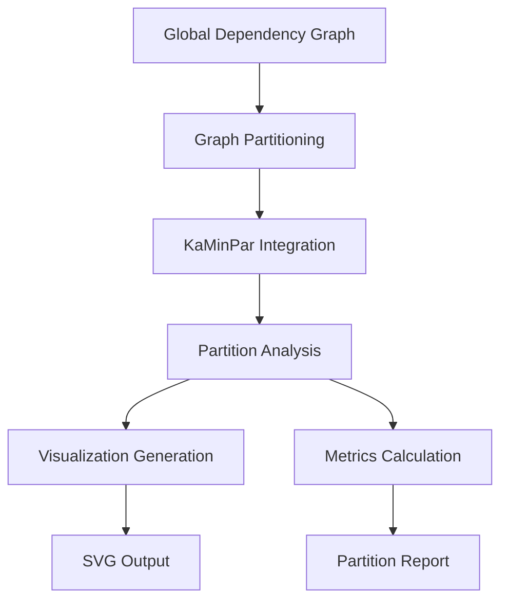
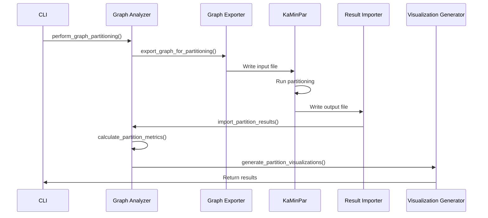

# Graph Partitioning System

## Overview

The Graph Partitioning System integrates with external graph partitioning tools like KaMinPar to divide the Solana dependency graph into meaningful modules. This enables:

- **Modular Analysis**: Understanding the system's natural component boundaries
- **Architectural Insights**: Identifying core vs. peripheral components
- **Visual Exploration**: Generating SVG visualizations for each module
- **Quality Metrics**: Calculating cohesion, coupling, and modularity

## System Architecture



## Key Components

### 1. Partition Data Structures

#### `GraphPartition`
Represents a single partition created by the partitioning algorithm:

```rust
pub struct GraphPartition {
    pub partition_id: usize,
    pub node_ids: Vec<String>,
    pub node_count: usize,
    pub edge_count: usize,
    pub is_core: bool,
    pub properties: HashMap<String, String>,
    pub metrics: PartitionMetrics,
}
```

#### `PartitionMetrics`
Comprehensive metrics for evaluating partition quality:

```rust
pub struct PartitionMetrics {
    pub internal_edges: usize,      // Edges within the partition
    pub external_edges: usize,      // Edges to other partitions
    pub density: f64,               // Internal connectivity
    pub modularity: f64,            // Quality measure
    pub cohesion: f64,             // Internal vs total edges
    pub coupling: f64,              // External vs total edges
}
```

### 2. Partitioning Algorithms

The system supports multiple partitioning algorithms:

- **KaMinPar**: High-quality multilevel partitioning (default)
- **Metis**: Popular graph partitioning library
- **Louvain**: Community detection algorithm
- **Kernighan-Lin**: Classic partitioning algorithm
- **Spectral**: Spectral clustering-based partitioning
- **Greedy**: Simple greedy algorithm (fallback)

### 3. Integration Workflow



## Usage

### CLI Commands

#### Perform Graph Partitioning
```bash
cargo-vendormod global-graph partition \
    --input-path ./analysis/global_graph/graph.json \
    --partition-count 8 \
    --balance-factor 0.03 \
    --algorithm kaminpar \
    --output-dir ./analysis/partitions
```

### Command Options

- `--input-path`: Path to the JSON graph file
- `--partition-count`: Number of partitions to create (default: 8)
- `--balance-factor`: Balance constraint (0.0-1.0, default: 0.03)
- `--algorithm`: Partitioning algorithm (kaminpar, metis, louvain, etc.)
- `--output-dir`: Output directory for results

### Output Files

The partitioning command generates:

```
analysis/partitions/
├── partition_report.md          # Comprehensive analysis report
├── partitioned_graph.json       # Graph with partition information
├── partition_overview.dot       # Overview visualization (DOT)
├── partition_overview.svg       # Overview visualization (SVG)
├── partitions/                  # Individual partition visualizations
│   ├── partition_0/             # Partition 0
│   │   ├── partition.dot         # DOT format
│   │   ├── partition.svg         # SVG format
│   │   └── summary.txt           # Text summary
│   ├── partition_1/             # Partition 1
│   │   ├── partition.dot
│   │   ├── partition.svg
│   │   └── summary.txt
│   └── ...                       # More partitions
└── partitions/                  # SVG versions of all DOT files
```

## Partitioning Process

### 1. Graph Export
Converts the dependency graph to KaMinPar format:

```
<node_count> <edge_count>
<from> <to> <weight>
<from> <to> <weight>
...
```

### 2. KaMinPar Execution
Runs the external partitioning tool with configured parameters:

```bash
KaMinPar graph_for_partitioning.txt partition_result.txt \
    --k 8 \
    --imbalance 0.03 \
    --seed 42
```

### 3. Result Import
Parses KaMinPar output and creates partition objects:

```
0    # Node 0 -> Partition 0
1    # Node 1 -> Partition 1
2    # Node 2 -> Partition 2
...
```

### 4. Metrics Calculation
Computes comprehensive metrics for each partition:

- **Density**: `internal_edges / (node_count * (node_count - 1))`
- **Cohesion**: `internal_edges / (internal_edges + external_edges)`
- **Coupling**: `external_edges / (internal_edges + external_edges)`
- **Modularity**: `cohesion - coupling`

### 5. Visualization Generation
Creates multiple visualization formats:

- **Overview**: Shows all partitions and inter-connections
- **Individual**: Detailed view of each partition
- **SVG Conversion**: Converts DOT files to SVG using Graphviz

## Partition Quality Metrics

### Core vs. Peripheral Partitions

- **Core Partitions**: High cohesion (>0.7), low coupling (<0.3)
- **Peripheral Partitions**: Lower cohesion, higher coupling

### Metrics Interpretation

| Metric | Ideal Range | Interpretation |
|--------|-------------|----------------|
| **Density** | 0.3-0.7 | Internal connectivity |
| **Cohesion** | 0.6-1.0 | Internal vs total edges |
| **Coupling** | 0.0-0.4 | External dependencies |
| **Modularity** | 0.2-0.8 | Overall quality |

### Example Metrics

```
Partition 0:
- Nodes: 42
- Edges: 187
- Density: 0.456
- Cohesion: 0.823
- Coupling: 0.177
- Modularity: 0.646
- Core: true
```

## Visualization Examples

### Partition Overview (SVG)


Shows:
- All partitions as nodes
- Inter-partition dependencies as edges
- Edge thickness represents dependency count
- Color coding (green = core, blue = peripheral)

### Individual Partition (SVG)


Shows:
- All nodes in the partition
- Internal dependencies
- Node labels with version information
- Partition metrics as comments

## Solana-Specific Partitioning

### Expected Partition Patterns

1. **Core Partitions**:
   - `solana-runtime`, `solana-sdk`, `solana-ledger`
   - High cohesion, low coupling
   - Fundamental system components

2. **Client Partitions**:
   - `solana-cli`, `solana-client`, `solana-wallet`
   - Medium cohesion, medium coupling
   - User-facing components

3. **Tooling Partitions**:
   - `solana-test-validator`, `solana-bench-tps`
   - Lower cohesion, higher coupling
   - Development and testing tools

4. **Program Partitions**:
   - `solana-program-library`, `solana-bpf-loader`
   - Variable cohesion based on program type
   - Smart contract components

### Partitioning Strategy for Solana

```bash
# Start with moderate partition count
cargo-vendormod global-graph partition \
    --partition-count 12 \
    --balance-factor 0.05 \
    --algorithm kaminpar \
    --output-dir ./analysis/solana_partitions

# Analyze results and adjust
# Increase partition count if partitions are too large
# Decrease if partitions are too small
```

## Advanced Usage

### Multi-Level Partitioning

```bash
# First level: Coarse partitioning
cargo-vendormod global-graph partition \
    --partition-count 4 \
    --output-dir ./analysis/level1_partitions

# Second level: Fine partitioning of large partitions
for i in 0 1 2 3; do
    cargo-vendormod global-graph partition \
        --input-path ./analysis/level1_partitions/partitioned_graph.json \
        --partition-count 4 \
        --output-dir ./analysis/level1_partitions/partition_${i}/subpartitions
    )
done
```

### Comparative Analysis

```bash
# Try different algorithms
for algo in kaminpar metis louvain; do
    cargo-vendormod global-graph partition \
        --algorithm $algo \
        --output-dir ./analysis/comparison/${algo}_partitions
done

# Compare results using partition reports
```

## Integration with KaMinPar

### KaMinPar Configuration

The system uses these KaMinPar parameters:

- `--k <partition_count>`: Number of partitions
- `--imbalance <balance_factor>`: Allowed imbalance
- `--seed 42`: Fixed seed for reproducibility

### KaMinPar Installation

```bash
# Install KaMinPar (Linux)
wget https://kaminpar.zib.de/downloads/kaminpar-2.0.0-linux-x86_64.tar.gz
tar -xzf kaminpar-2.0.0-linux-x86_64.tar.gz
mv kaminpar-2.0.0-linux-x86_64/KaMinPar /usr/local/bin/
chmod +x /usr/local/bin/KaMinPar

# Verify installation
KaMinPar --help
```

### Fallback Mechanism

If KaMinPar is not available, the system uses a simple round-robin partitioning algorithm:

```rust
for i in 0..node_count {
    let partition_id = i % partition_count;
    partition_assignments.push(partition_id);
}
```

## Performance Considerations

### Large Graph Handling

- **Memory**: KaMinPar requires ~10x graph size in memory
- **Time**: Partitioning time scales with graph size and partition count
- **Disk**: Temporary files can be large for big graphs

### Optimization Strategies

1. **Incremental Partitioning**: Partition subsets first, then combine
2. **Sampling**: Use representative samples for initial analysis
3. **Parallel Processing**: Run multiple partitioning attempts concurrently
4. **Caching**: Cache partitioning results for repeated analysis

## Error Handling

### Common Issues and Solutions

| Issue | Solution |
|-------|----------|
| KaMinPar not found | Install KaMinPar or use fallback algorithm |
| Graph too large | Increase memory or use sampling |
| Unbalanced partitions | Adjust balance factor or algorithm |
| Poor partition quality | Try different algorithms or parameters |

### Debugging Tips

```bash
# Check KaMinPar installation
which KaMinPar
KaMinPar --version

# Test with small graph first
cargo-vendormod global-graph partition \
    --partition-count 2 \
    --input-path small_graph.json

# Monitor resource usage
time cargo-vendormod global-graph partition
```

## Best Practices

### Partition Count Selection

| Workspace Size | Recommended Partitions |
|----------------|-----------------------|
| Small (10-50 crates) | 4-8 |
| Medium (50-200 crates) | 8-16 |
| Large (200-500 crates) | 16-32 |
| Very Large (500+ crates) | 32-64 |

### Balance Factor Guidelines

| Use Case | Balance Factor |
|----------|----------------|
| Strict balance | 0.01-0.03 |
| Moderate balance | 0.03-0.05 |
| Flexible balance | 0.05-0.10 |

### Algorithm Selection

| Algorithm | Best For | Quality | Speed |
|-----------|----------|--------|-------|
| KaMinPar | General purpose | ⭐⭐⭐⭐⭐ | ⭐⭐⭐⭐ |
| Metis | Large graphs | ⭐⭐⭐⭐ | ⭐⭐⭐ |
| Louvain | Community detection | ⭐⭐⭐ | ⭐⭐⭐⭐ |
| Spectral | Well-connected graphs | ⭐⭐⭐⭐ | ⭐⭐ |
| Greedy | Quick analysis | ⭐⭐ | ⭐⭐⭐⭐⭐ |

## Future Enhancements

1. **Automatic Parameter Tuning**: Optimize partition count and balance factor
2. **Multi-Algorithm Comparison**: Run multiple algorithms and compare results
3. **Interactive Visualization**: Web-based partition explorer
4. **Change Detection**: Track partition stability over time
5. **Refactoring Suggestions**: Recommend code organization improvements
6. **Performance Profiling**: Correlate partitions with performance metrics
7. **Team Mapping**: Align partitions with team boundaries

## Conclusion

The Graph Partitioning System provides powerful tools for understanding and visualizing the modular structure of the Solana workspace. By integrating with state-of-the-art partitioning algorithms and generating comprehensive visualizations, it enables architects and developers to:

- **Understand** the natural component boundaries in the system
- **Evaluate** the quality of the current architecture
- **Plan** refactoring and reorganization efforts
- **Communicate** the system structure to stakeholders
- **Optimize** build and test pipelines based on module boundaries

The combination of quantitative metrics and visual exploration makes this system an essential tool for maintaining and evolving large-scale Rust projects like Solana.
